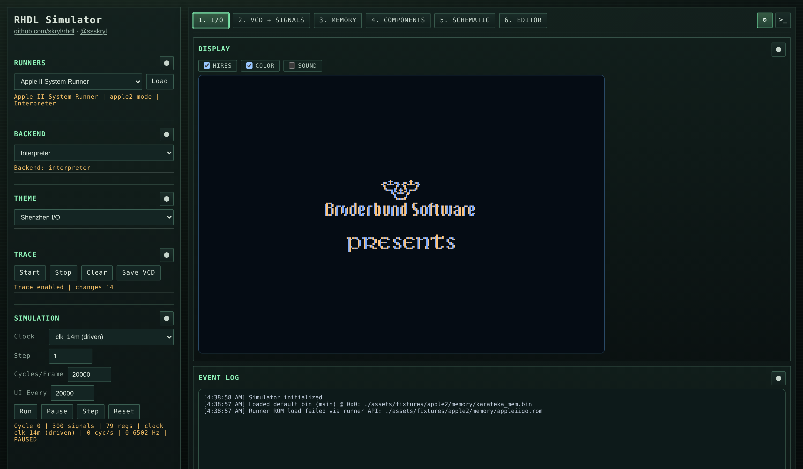
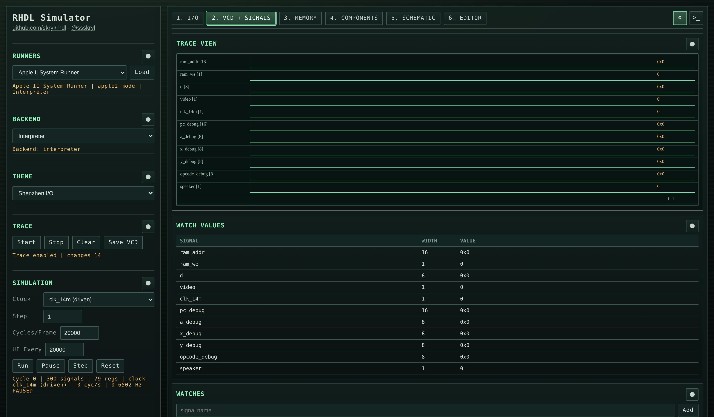
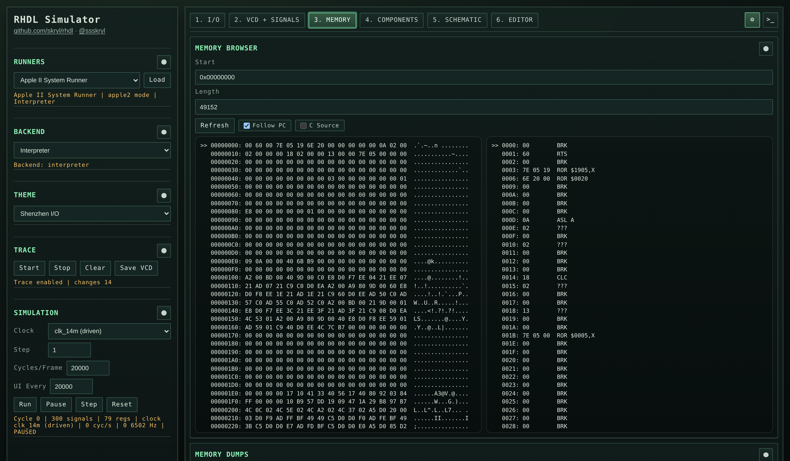
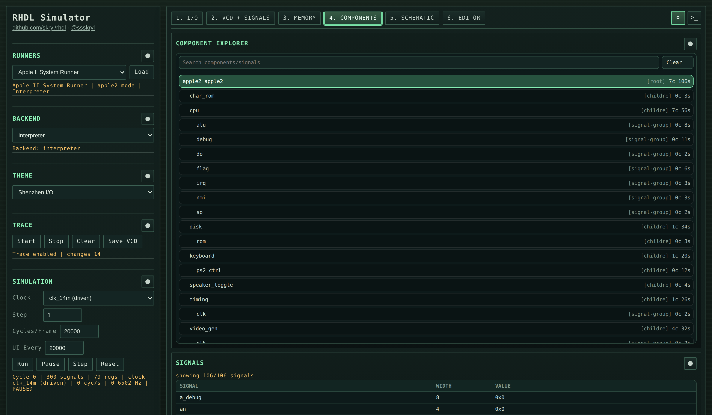
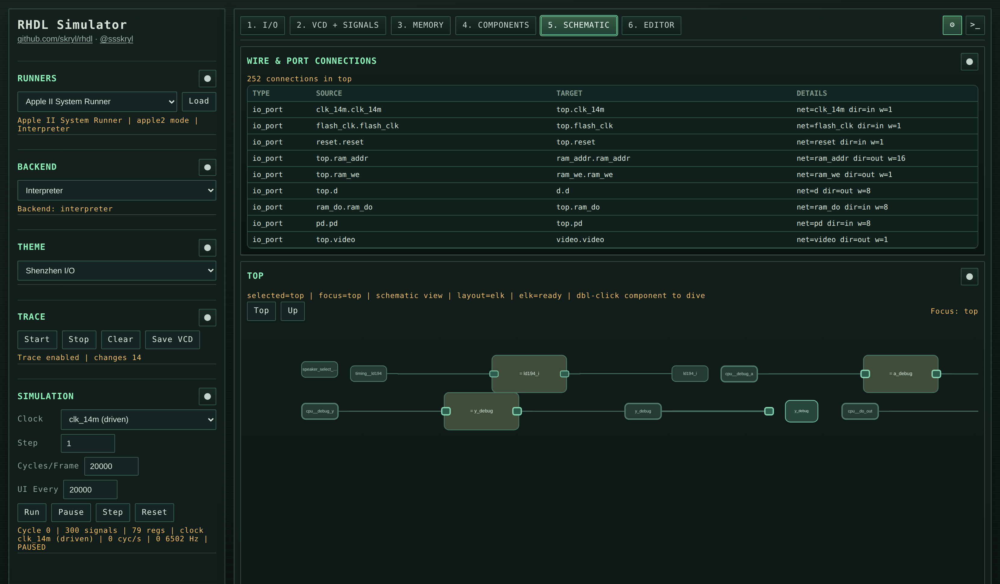

# RHDL IR Web Simulator (p5.js + WASM)

This app runs RHDL IR simulator backends in the browser via WebAssembly and renders live VCD waveforms with p5.js.

Architecture reference: `web_architecture.md`.

## Features

- Load RHDL-generated IR JSON
- Select backend (`interpreter`, `jit`, `compiler`)
- Preconfigured runner presets (Generic, CPU, Apple II)
- One-click Apple II runner setup (IR + ROM load)
- Step, run, pause, reset simulation
- Clocked stepping (forced clock edge) or unclocked ticking
- Tunable run pacing: `Cycles/Frame` and `UI Every` (cycles) to batch simulation and reduce UI/VCD overhead
- Live VCD streaming from Rust tracer to the browser
- Watch list + current value table
- Value breakpoints (`signal == value`)
- Export full VCD file for GTKWave
- Redux-backed UX state store (CDN, no build step) for tooling/automation
- LitElement UI components with co-located styles (no build step)
- Panel components split into modules under `web/app/components/*.mjs` (no build step)
- Tabbed workspace:
  - `1. I/O`: Apple II display + `HIRES`, `COLOR`, `SOUND` toggles, keyboard input queue, debug registers
  - `2. VCD + Signals`: waveform canvas, watch table, event log
  - `3. Memory`: RAM browser + direct byte writes + memory dump loading
  - `4. Components`: source-backed component details (`RHDL` + `Verilog`) when source bundles are present
- Memory dump utilities:
  - `Save Dump` exports current Apple II RAM to `.bin` and stores it as "last saved"
  - `Download Snapshot` exports current Apple II RAM as a portable `.rhdlsnap` file (includes `startPc` when available)
  - `Load Dump` accepts both raw binary dumps and `.rhdlsnap` snapshot files
  - `Load Last Saved` restores the most recently saved dump from browser storage
  - `Reset (Vector)` resets the Apple II runner from the Memory tab, with optional manual reset-vector override (`$B82A` / `0xB82A`)

## Screenshots

### I/O



### VCD + Signals



### Memory



### Components



### Schematic



## Build WASM

Build web artifacts (IR/source/schematic fixtures + memory fixtures + WASM backends):

```bash
bundle exec rake web:generate
```

`ir_compiler` is built as AOT for web:
- `web:generate` runs `ir_compiler`'s `aot_codegen` over `assets/fixtures/apple2/ir/apple2.json` by default.
- Then it builds `ir_compiler.wasm` with `--features aot`.

## Run Web UI

Serve the `web` directory with any static file server:

```bash
cd web
python3 -m http.server 8080
```

Open [http://localhost:8080](http://localhost:8080).

## Deploy To GitHub Pages

- A workflow is included at `.github/workflows/pages.yml`.
- It builds all web artifacts via `bundle exec rake web:generate`.
- It publishes a static artifact containing:
  - `web/index.html`
  - `web/app/`
  - `web/assets/`
- Enable Pages in repository settings:
  - `Settings -> Pages -> Source: GitHub Actions`
- Deploy URL will be exposed in the workflow run after the `deploy` job completes.

## Run Tests

Run all web unit tests (no build step required):

```bash
node --test $(find web/test -type f -name '*.test.mjs' | sort)
```

Run only browser integration smoke tests (Playwright):

```bash
cd web
npm install
npx playwright install chromium
npm run test:integration
```

Run only state store tests:

```bash
node --test web/test/state/store.test.mjs
```

## Notes

- The selected dropdown sample is loaded automatically on startup (default: `assets/fixtures/apple2/ir/apple2.json`).
- Backend selection is in the left control panel.
- `interpreter` is the default browser backend.
- `compiler` in the web UI is `ir_compiler` AOT (precompiled wasm), not runtime `rustc` compilation in-browser.
- Apple II / CPU runner assets are included under `assets/fixtures/`:
  - `assets/fixtures/apple2/ir/apple2.json` (from `examples/apple2/hdl/apple2`)
  - `assets/fixtures/apple2/ir/apple2_sources.json` (`RHDL` + `Verilog` sources for Apple II components)
  - `assets/fixtures/apple2/ir/apple2_schematic.json` (precomputed schematic connectivity for Apple II)
  - `assets/fixtures/cpu/ir/cpu_sources.json` (`RHDL` + `Verilog` sources for CPU components)
  - `assets/fixtures/cpu/ir/cpu_schematic.json` (precomputed schematic connectivity for CPU)
  - `assets/fixtures/apple2/memory/appleiigo.rom` (12KB system ROM)
  - `assets/fixtures/apple2/memory/karateka_mem.bin` + `assets/fixtures/apple2/memory/karateka_mem_meta.txt` for quick dump load
- Regenerate web artifacts (IR + source + schematic):
  - `bundle exec rake web:generate`
- Memory tab supports:
  - arbitrary dump file load at offset (via Apple II RAM interface)
  - one-click Karateka dump load (patches reset vector and resets to dump PC)
- Clock options are labeled by execution mode:
  - `forced`: direct process clock stepping (`tick_forced`)
  - `driven`: toggle external clock (for example top-level `clk`) and propagate through combinational logic
- The UI consumes incremental VCD chunks from `trace_take_live_vcd()` each frame.
- Redux state bridge (if `redux.min.js` loads):
  - store: `window.__RHDL_REDUX_STORE__`
  - current in-memory app state: `window.__RHDL_UX_STATE__`
  - manual sync helper: `window.__RHDL_REDUX_SYNC__('manual')`
