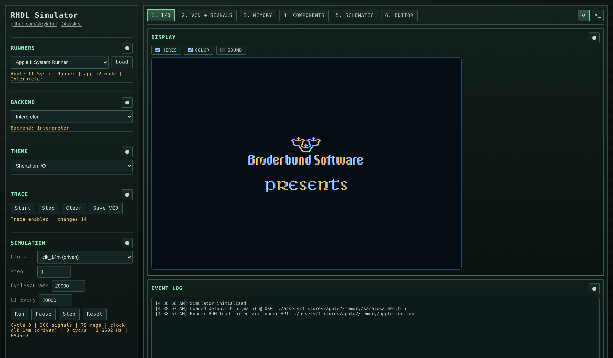
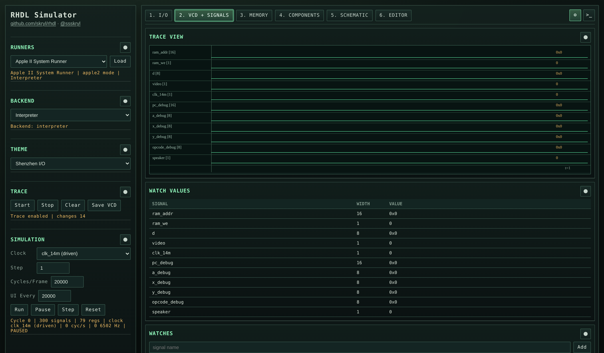
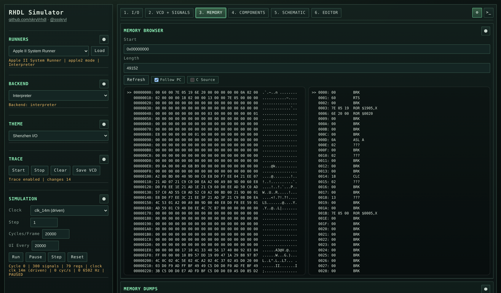
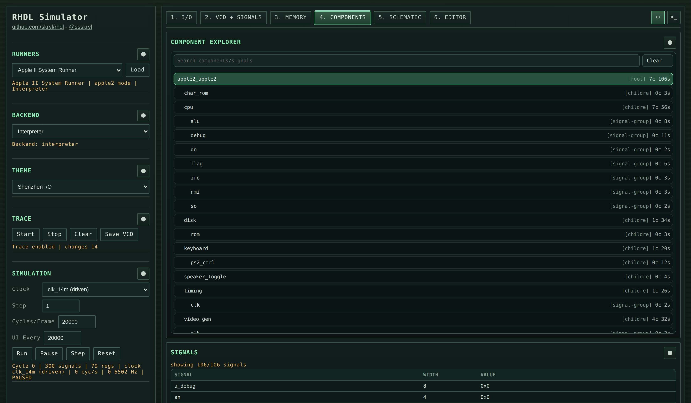
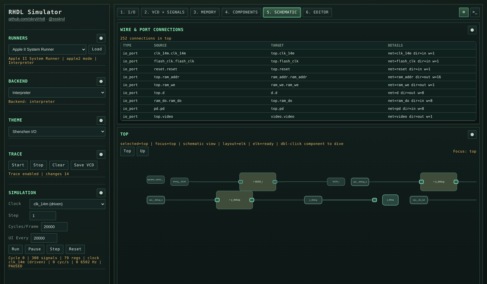

# RHDL IR Web Simulator (p5.js + WASM)

This app runs RHDL IR simulator backends in the browser via WebAssembly and renders live VCD waveforms with p5.js.

Architecture details are included at the bottom of this page.

## Features

- Load RHDL-generated IR JSON
- Select backend (`interpreter`, `jit`, `compiler`)
- Preconfigured runner presets (Generic, CPU, MOS 6502, Apple II, Game Boy)
- One-click Apple II runner setup (IR + ROM load)
- Step, run, pause, reset simulation
- Clocked stepping (forced clock edge) or unclocked ticking
- Tunable run pacing: `Cycles/Frame` and `UI Every` (cycles) to batch simulation and reduce UI/VCD overhead
- Live VCD streaming from Rust tracer to the browser
- Watch list + current value table
- Value breakpoints (`signal == value`)
- Export full VCD file for GTKWave
- Redux-backed UX state store (CDN, no build step) for tooling/automation
- LitElement UI components with co-located styles (no build step)
- Panel components split into modules under `web/app/components/*.mjs` (no build step)
- Built-in terminal command dispatcher for runner/backend switching, stepping, watches, breakpoints, and memory helpers
- Tabbed workspace:
  - `1. I/O`: Apple II display + `HIRES`, `COLOR`, `SOUND` toggles, keyboard input queue, debug registers
  - `2. VCD + Signals`: waveform canvas, watch table, event log
  - `3. Memory`: RAM browser + direct byte writes + memory dump loading
  - `4. Components`: source-backed component details (`RHDL` + `Verilog`) when source bundles are present
- Memory dump utilities:
  - `Save Dump` exports current Apple II RAM to `.bin` and stores it as "last saved"
  - `Download Snapshot` exports current Apple II RAM as a portable `.rhdlsnap` file (includes `startPc` when available)
  - `Load Dump` accepts both raw binary dumps and `.rhdlsnap` snapshot files
  - `Load Last Saved` restores the most recently saved dump from browser storage
  - `Reset (Vector)` resets the Apple II runner from the Memory tab, with optional manual reset-vector override (`$B82A` / `0xB82A`)

## Screenshots

### I/O



### VCD + Signals



### Memory



### Components



### Schematic



## Build WASM

Build only WASM backends:

```bash
bundle exec rake web:build
```

Generate web artifacts (IR/source/schematic fixtures + memory fixtures). If WASM artifacts are missing, this task builds them first:

```bash
bundle exec rake web:generate
```

`ir_compiler` is built as AOT for web:
- `web:build` runs `ir_compiler`'s `aot_codegen` over `assets/fixtures/apple2/ir/apple2.json` by default.
- Then it builds `ir_compiler.wasm` with `--features aot`.

## Run Web UI

Serve the `web` directory:

```bash
bundle exec rake web:start
```

`web:start` serves with cross-origin isolation headers required for `SharedArrayBuffer`:

- `Cross-Origin-Opener-Policy: same-origin`
- `Cross-Origin-Embedder-Policy: require-corp`
- `Cross-Origin-Resource-Policy: same-origin`

If you use a custom server, you must set equivalent headers.

Without those headers, the mirb worker will not be able to use `SharedArrayBuffer`.

Manual example (must be configured to emit COOP/COEP):

```bash
cd web
python3 -m http.server 8080
```

Open [http://localhost:8080](http://localhost:8080).

## Runner Presets and Defaults

Runner presets are generated into:

- `web/app/components/runner/config/generated_presets.mjs`

Current generated runner order:

- `generic` (manual IR runner, from `presets.mjs`)
- `cpu`
- `mos6502`
- `apple2`
- `gameboy`
- `riscv`

Current defaults:

- Default runner preset: `apple2`
- Default backend state: `compiler` (`Compiler (AOT)`)

Preset generation source list is controlled by:

- `lib/rhdl/cli/tasks/web_generate_task.rb` (`RUNNER_CONFIG_PATHS`)

Current generated list includes:

- `examples/8bit/config.json`
- `examples/mos6502/config.json`
- `examples/apple2/config.json`
- `examples/gameboy/config.json`
- `examples/riscv/config.json`

RISC-V web preset status:

- Included by default in `RUNNER_CONFIG_PATHS` and exported as `riscv`.
- Mapped to UART I/O (`mode: uart`) with:
  - `./assets/fixtures/riscv/software/bin/kernel.bin`
  - `./assets/fixtures/riscv/software/bin/fs.img`
  - `./assets/pkg/ir_compiler_riscv.wasm`
  - custom xv6 kernel/disk binaries can be swapped in through runner controls, but the defaults above are the shipped preloads
- Note: the checked-in generated preset in this checkout currently uses `fastBoot: aggressive`; regenerate assets from `examples/riscv/config.json` if you need alignment with source config defaults.
- If `riscv` assets are not generated, preset selection still appears but default boot will skip/fail the required loads.

## Deploy To GitHub Pages

- A workflow is included at `.github/workflows/pages.yml`.
- It builds all web artifacts via `bundle exec rake web:generate`.
- It publishes a static artifact containing:
  - `web/index.html`
  - `web/coi-serviceworker.js`
  - `web/app/`
  - `web/assets/`
- GitHub Pages does not let this repo configure COOP/COEP response headers directly.
- `index.html` registers `coi-serviceworker.js` to inject COOP/COEP/CORP on same-origin responses as a fallback.
- Enable Pages in repository settings:
  - `Settings -> Pages -> Source: GitHub Actions`
- Deploy URL will be exposed in the workflow run after the `deploy` job completes.

## Run Tests

Run all web unit tests (no build step required):

```bash
node --test $(find web/test -type f -name '*.test.mjs' | sort)
```

Run only browser integration smoke tests (Playwright):

```bash
cd web
npm install
npx playwright install chromium
npm run test:integration
```

Useful integration suites:

- `web/test/integration/app_load.test.mjs`
- `web/test/integration/app_flows.test.mjs`
- `web/test/integration/mos6502_compiler_backend.test.mjs`
- `web/test/integration/cpu8bit_default_bin_autoload.test.mjs`
- `web/test/integration/cpu8bit_programs.test.mjs`
- `web/test/integration/memory_dump_asset_tree.test.mjs`
- `web/test/integration/memory_follow_pc_highlight.test.mjs`

Run only state store tests:

```bash
node --test web/test/state/store.test.mjs
```

## Notes

- The selected dropdown sample is loaded automatically on startup (default: `assets/fixtures/apple2/ir/apple2.json`).
- Backend selection is in the left control panel.
- `compiler` (AOT wasm) is the default backend state at startup.
- `compiler` in the web UI is `ir_compiler` AOT (precompiled wasm), not runtime `rustc` compilation in-browser.
- Terminal command help is available in-app via `help` and includes runner/backend/theme/sim/watch/breakpoint/memory actions.
- Apple II / CPU runner assets are included under `assets/fixtures/`:
  - `assets/fixtures/apple2/ir/apple2.json` (from `examples/apple2/hdl/apple2`)
  - `assets/fixtures/apple2/ir/apple2_sources.json` (`RHDL` + `Verilog` sources for Apple II components)
  - `assets/fixtures/apple2/ir/apple2_schematic.json` (precomputed schematic connectivity for Apple II)
  - `assets/fixtures/cpu/ir/cpu_sources.json` (`RHDL` + `Verilog` sources for CPU components)
  - `assets/fixtures/cpu/ir/cpu_schematic.json` (precomputed schematic connectivity for CPU)
- `assets/fixtures/apple2/memory/appleiigo.rom` (12KB system ROM)
- `assets/fixtures/apple2/memory/karateka_mem.bin` + `assets/fixtures/apple2/memory/karateka_mem_meta.txt` for quick dump load
- Build/update wasm backends only:
  - `bundle exec rake web:build`
- Regenerate web artifacts (IR + source + schematic):
  - `bundle exec rake web:generate`
- Memory tab supports:
  - arbitrary dump file load at offset (via Apple II RAM interface)
  - one-click Karateka dump load (patches reset vector and resets to dump PC)
- Clock options are labeled by execution mode:
  - `forced`: direct process clock stepping (`tick_forced`)
  - `driven`: toggle external clock (for example top-level `clk`) and propagate through combinational logic
- The UI consumes incremental VCD chunks from `trace_take_live_vcd()` each frame.
- Redux state bridge (if `redux.min.js` loads):
  - store: `window.__RHDL_REDUX_STORE__`
  - current in-memory app state: `window.__RHDL_UX_STATE__`
  - manual sync helper: `window.__RHDL_REDUX_SYNC__('manual')`

## Web App Architecture

This section describes the current architecture of the RHDL web simulator and where responsibilities live.

### Runtime Model

- `web/app/bootstrap.mjs` is the composition root.
- `web/app/main.mjs` loads UI components and starts bootstrap.
- Bootstrap creates:
  - DOM refs (`bindings/dom_bindings.mjs`)
  - mutable runtime context (`runtime/context.mjs`)
  - mutable UX state (`state/initial_state.mjs`)
  - Redux store + bridge (`state/store.mjs`, `state/store_bridge.mjs`)
  - controller registry (`controllers/registry_controller.mjs`)
  - startup orchestration (`controllers/startup_controller.mjs`)

### Layering

- `state/`: reducers, actions, store plumbing, redux sync helpers.
- `runtime/`: backend definitions, wasm simulator wrapper, VCD parser.
- `controllers/`: app behavior and orchestration. High-level intent lives here.
- `controllers/terminal/`: command routing and command handlers.
- `controllers/registry_lazy/`: lazy construction for heavy controller/managers.
- `managers/`: reusable behavior units (watch manager, dashboard layout manager).
- `bindings/`: DOM event wiring that maps UI events to controller-domain operations.
- `components/`: LitElement panels and rendering helpers.
- `lib/`: shared pure utilities (numeric parsing, IR metadata, dashboard/state helpers).

### Registry + Domains

`createControllerRegistry` returns grouped domains consumed by startup/bindings:

- `shell`
- `runner`
- `components`
- `apple2`
- `sim`
- `watch`

Each domain exposes cohesive capabilities instead of one flat API bag. Lazy getters in
`controllers/registry_lazy/*` defer heavy object construction until needed.

### Startup Contract

`startApp` receives explicit grouped dependencies:

- `env`: host environment hooks
- `store`: state dispatchers/sync helpers
- `util`: pure utility functions
- `keys`: storage keys/constants
- `bindings`: binding constructors + UI binding registry
- `app`: registry domains

This keeps startup deterministic and testable without browser globals.

### UI Composition

- `index.html` contains shell markup and panel containers.
- Lit components (`components/*.mjs`) own panel-specific rendering and styles.
- Bindings attach listeners and call domain methods.
- Redux sync snapshots app state for toolability and test instrumentation.

### Testing Strategy

- Unit tests:
  - controller units (`test/controllers`)
  - binding units (`test/bindings`)
  - manager/runtime/lib/state modules
- Browser integration tests (`test/integration`):
  - app load smoke
  - core user flows (runner load, memory dump actions, run/pause, terminal commands)

### Static Assets

- `assets/pkg`: wasm artifacts.
- `assets/fixtures`: generated IR/source/schematic fixtures and sample binary assets.
- `bundle exec rake web:build`: wasm build pipeline entrypoint.
- `bundle exec rake web:generate`: web asset generation entrypoint (builds wasm first when missing).
